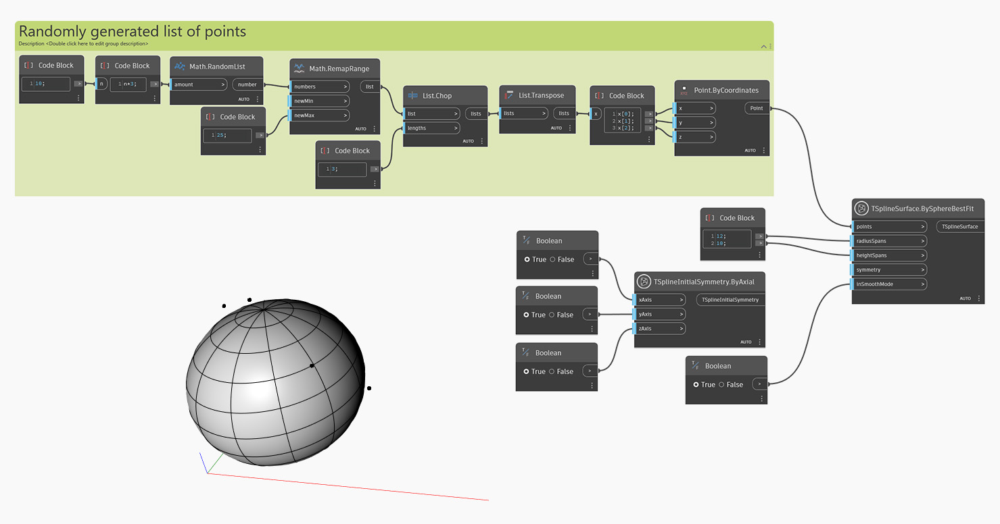

<!--- Autodesk.DesignScript.Geometry.TSpline.TSplineSurface.BySphereBestFit --->
<!--- RUAGD4YGKJ6XHPIKDL7GZX63CDAFMI6KUSR6XMXEBGJJOATEI5IA --->
## Profondeur
Dans l'exemple ci-dessous, une surface primitive de sphère T-Spline est créée à l'aide du noeud 'TSplineSurface.BySphereBestFit' à partir d'une liste fournie de points aléatoires. Les entrées 'radiusSpans' et 'heightSpans' contrôlent le nombre de faces le long de la hauteur et des portées radiales (ou méridiens). L'entrée 'symmetry' contrôle si la forme a une symétrie initiale et, enfin, 'inSmoothMode' définit si l'aperçu est en mode lissage ou en mode boîte.

## Exemple de fichier

