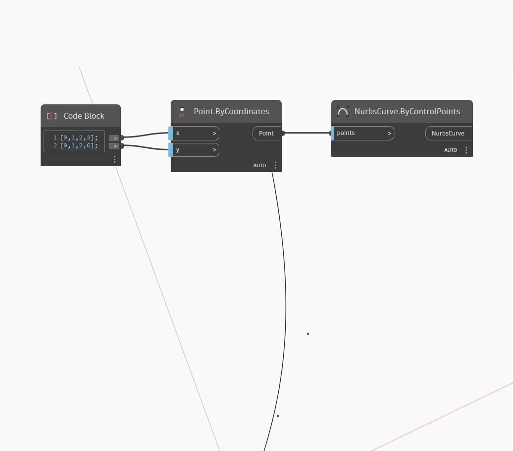

<!--- Autodesk.DesignScript.Geometry.NurbsCurve.ByControlPoints(points) --->
<!--- UBBQRVGE4HKFTNK4OFRC7ZXLV26MFZNZQZQ5FXSM3ABCG36L4XBQ --->
## Description approfondie
NurbsCurve ByControlPoints permet d'entrer une liste de points à utiliser comme points de contrôle et génère une courbe Nurbs. Cet exemple utilise un Code Block pour générer deux listes correspondant aux emplacements X et Y d'une série de points. Les points sont utilisés pour dessiner la courbe Nurbs.
___
## Exemple de fichier

