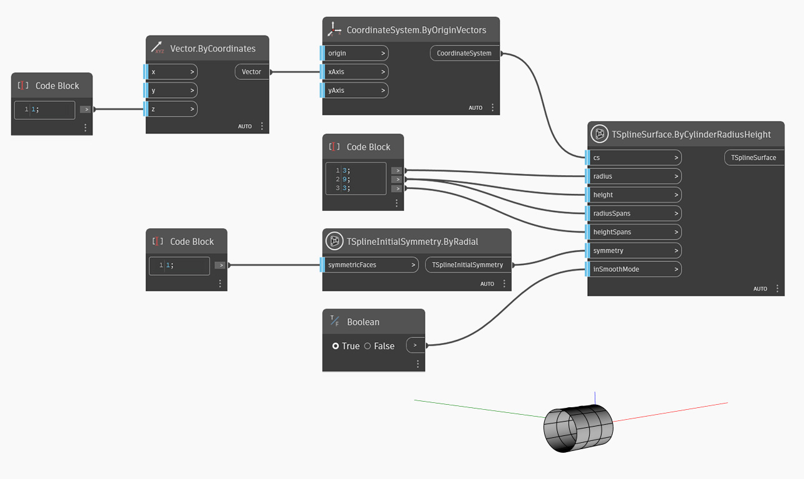

<!--- Autodesk.DesignScript.Geometry.TSpline.TSplineSurface.ByCylinderRadiusHeight --->
<!--- WGMB4D4GWPYAS6YAOVBQIXYPGCBRH3KEF437CWWZGSXVEZXLRGTQ --->
## In-Depth
Dans l'exemple ci-dessous, une surface de cylindre de primitive de T-Spline est créée. La position et l'orientation du cylindre sont définies par le système de coordonnées dans l'entrée `cs`. Les valeurs `rayon` et `hauteur` définissent la taille du cylindre. Les segments dans les directions radiale et de hauteur sont contrôlés par les entrées `radiusSpans` et `heightSpans`. La symétrie initiale de la forme est spécifiée par l'entrée `symmétrie`. Si la symétrie X ou Y est définie sur True, la valeur des segments de rayon doit être un multiple de 4. Enfin, l'entrée `inSmoothMode` est utilisée pour passer du mode lisse au mode boîte afin d'afficher un aperçu de la surface de T-Spline.

## Exemple de fichier

