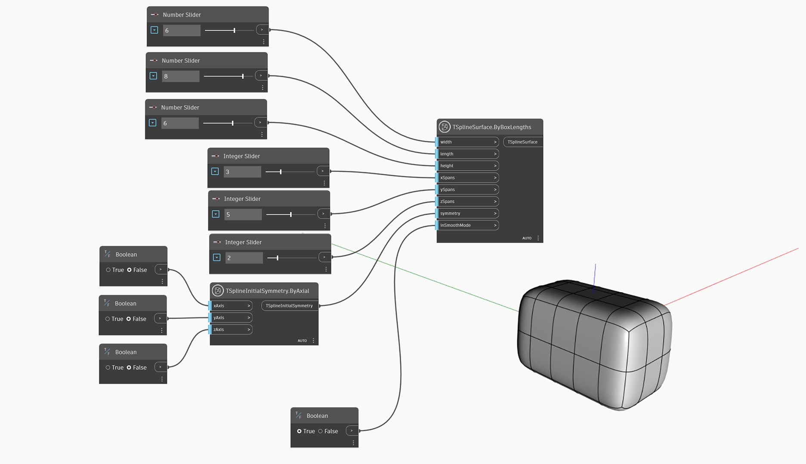

<!--- Autodesk.DesignScript.Geometry.TSpline.TSplineSurface.ByBoxLengths(width, length, height, xSpans, ySpans, zSpans, symmetry, inSmoothMode) --->
<!--- WN6BWNG6A6KOPFMMRBHLV7XBOOEGXTSO5I5FZXHKKUG5YO6MNNYA --->
## In-Depth
`TSplineSurface.ByBoxLengths(width, length, height, xSpans, ySpans, zSpans, symmetry, inSmoothMode)` crée une surface de boîte de T-Spline dont les dimensions sont définies par les entrées `largeur`, `longueur` et `hauteur` et le nombre de segments X, Y et Z dans chaque direction. La boîte est centrée autour de l'origine (0, 0, 0). Les options de symétrie peuvent être spécifiées avec l'entrée `symétrie`. L'entrée booléenne `inSmoothMode` permet de basculer entre le mode d'aperçu lisse et le mode boîte.

## Exemple de fichier

