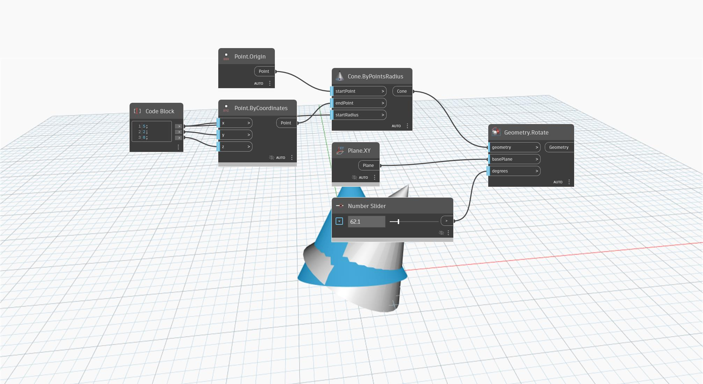

<!--- Autodesk.DesignScript.Geometry.Geometry.Rotate(geometry, basePlane, degrees) --->
<!--- XFRRMCMTIOHR6PV6TSFT3WDOBWKWHFMLXAMO7W5HDBP47YU5C2WQ --->
## Description approfondie
`Geometry.Rotate (basePlane, degrees)` fait pivoter une géométrie d'entrée autour d'un point d'origine et d'un vecteur d'axe selon un degré donné.

Dans l'exemple ci-dessous, un cône pivote autour du vecteur d'axe Y en fonction de son point d'arrivée.

___
## Exemple de fichier

