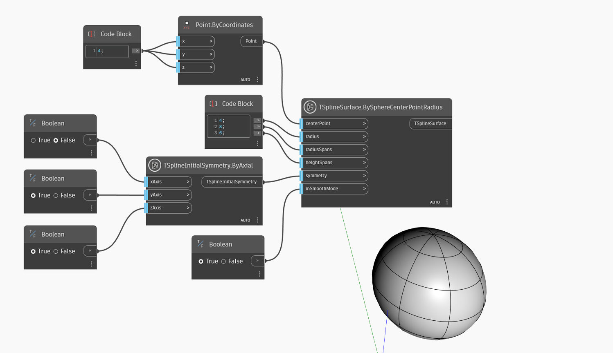

<!--- Autodesk.DesignScript.Geometry.TSpline.TSplineSurface.BySphereCenterPointRadius --->
<!--- 3W2XHZKQEZFB7P3OTUVOZUMCD3M7PKUFQZI42URWMPFARFIN2NVQ --->
## In profondità
Nell'esempio seguente, viene creata una superficie della primitiva della sfera T-Spline utilizzando il nodo `TSplineSurface.BySphereCenterPointRadius`. L'input `centerPoint` definisce l'origine della sfera e `radius` ne specifica la dimensione. Gli input `radiusSpans` e `heightSpans` controllano il numero di facce lungo le campate di altezza e radiali (o i meridiani). `symmetry` controlla se la forma presenta una simmetria iniziale e, infine, `inSmoothMode` definisce se l'anteprima è in modalità uniforme o riquadro.

## File di esempio

