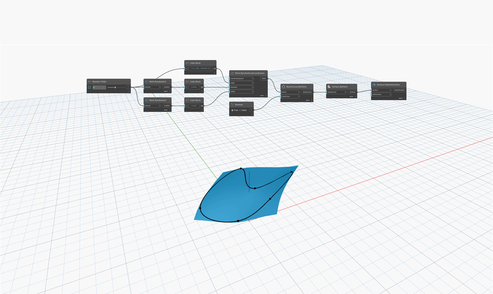

<!--- Autodesk.DesignScript.Geometry.Surface.ToNurbsSurface(surface, limitSurface) --->
<!--- 62R7TNV2KCZCI3DMDQF7KVWE5WHQRXUHIVL625TVQLCENC23EMBA --->
## In profondità
`Surface.ToNurbsSurface` utilizza una superficie come input e restituisce una NurbsSurface che si avvicina alla superficie di input. L'input `limitSurface` determina se per la superficie deve essere ripristinato l'intervallo di parametri originale prima della conversione, ad esempio quando l'intervallo di parametri di una superficie è limitato dopo un'operazione di taglio.

Nell'esempio seguente, viene creata una superficie utilizzando un nodo `Surface.ByPatch` con una NurbsCurve chiusa come input. Tenere presente che quando si utilizza questa superficie come input per un nodo `Surface.ToNurbsSurface`, il risultato è una NurbsSurface non tagliata con quattro lati.

___
## File di esempio

