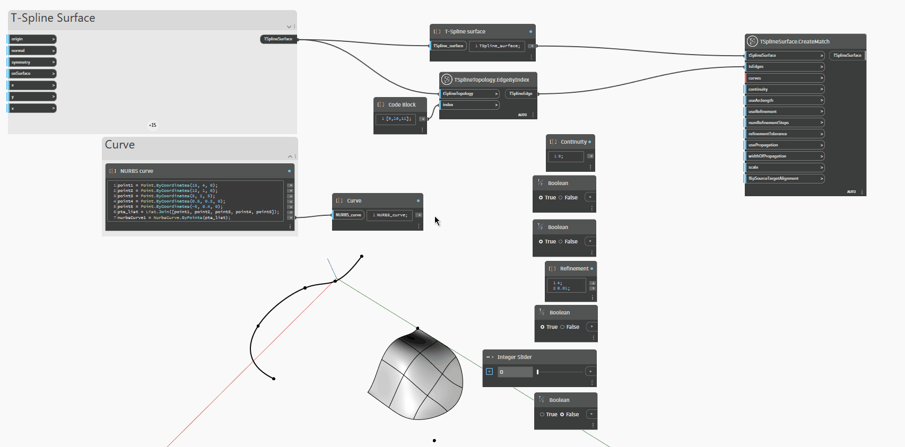

## In profondità

Nell'esempio seguente, una superficie T-Spline viene abbinata ad una curva NURBS utilizzando
il nodo `TSplineSurface.CreateMatch(tSplineSurface,tsEdges,curves)`. L'input minimo richiesto per il
nodo è la base `tSplineSurface`, un gruppo di bordi della superficie, fornito nell'input `tsEdges` e una curva o un
elenco di curve.
I seguenti input controllano i parametri della corrispondenza:
- `continuity` consente di impostare il tipo di continuità per la corrispondenza. L'input prevede valori 0, 1 o 2, corrispondenti alla continuità G0 posizionale, G1 tangente e G2 curvatura. Tuttavia, per la corrispondenza di una superficie con una curva, è disponibile solo G0 (valore di input 0).
- `useArcLength` controlla le opzioni del tipo di allineamento. Se è impostato su True, il tipo di allineamento utilizzato è lunghezza
dell'arco. Questo allineamento riduce al minimo la distanza fisica tra ogni punto della superficie T-Spline e
il punto corrispondente sulla curva. Quando viene fornito l'input False, il tipo di allineamento è parametrico -
ogni punto sulla superficie T-Spline viene abbinato ad un punto di distanza parametrica comparabile lungo la
curva di destinazione della corrispondenza.
- `useRefinement` se impostato su True, aggiunge punti di controllo alla superficie nel tentativo di corrispondere alla destinazione
entro un determinato valore `refinementTolerance`
- `numRefinementSteps` è il numero massimo di suddivisioni della superficie T-Spline di base
durante il tentativo di raggiungere `refinementTolerance`. Sia `numRefinementSteps` che `refinementTolerance` verranno ignorati se `useRefinement` è impostato su False.
- `usePropagation` controlla la quantità di superficie interessata dalla corrispondenza. Quando è impostata su False, la superficie viene influenzata minimamente. Quando è impostata su True, la superficie viene influenzata entro la distanza `widthOfPropagation` fornita.
- `scale` è la scala di tangenza che influisce sui risultati per la continuità G1 e G2.
- `flipSourceTargetAlignment` inverte la direzione di allineamento.

## File di esempio

