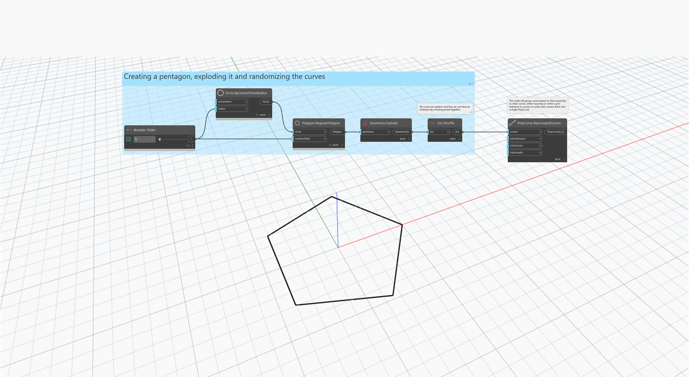

<!--- Autodesk.DesignScript.Geometry.PolyCurve.ByGroupedCurves(curves, joinTolerance, trimCurves, trimLength) --->
<!--- 6Z5ORNUUOKVQFG6ZBYHMWKQR457NCZXFTI27PNFF3MSQGVPTVZ2A --->
## In profondità
`PolyCurve.ByGroupedCurves` crea una nuova PolyCurve raggruppando più curve connesse. Raggruppa le curve in base alla loro prossimità ad altre curve, che sono tangenti o all'interno di una determinata tolleranza di unione, per connetterle in un'unica PolyCurve.

Nell'esempio seguente, un pentagono viene esploso e le relative curve vengono rese casuali. `PolyCurve.ByGroupedCurves` viene quindi utilizzato per raggrupparle in una PolyCurve.
___
## File di esempio

