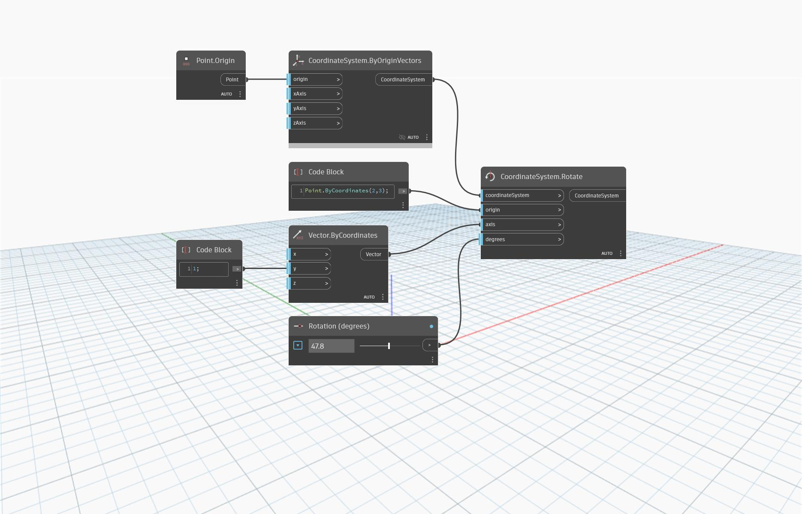

<!--- Autodesk.DesignScript.Geometry.CoordinateSystem.Rotate(coordinateSystem, origin, axis, degrees) --->
<!--- AUJIYC7MERJPYMO5VHIFF7FPJD5YMEBOHOMWKROVKZCF66ZIBZ2A --->
## In profondità
`CoordinateSystem.Rotate (coordinateSystem, origin, axis, degrees)` restituisce un nuovo CoordinateSystem ruotato attorno ad un'origine e ad un vettore.

Nell'esempio seguente, un CoordinateSystem viene ruotato attorno a un punto di origine in corrispondenza di (2,0,0) e a un vettore equivalente all'asse Y. È possibile eseguire rotazioni più complesse con vettori più complessi.

___
## File di esempio

