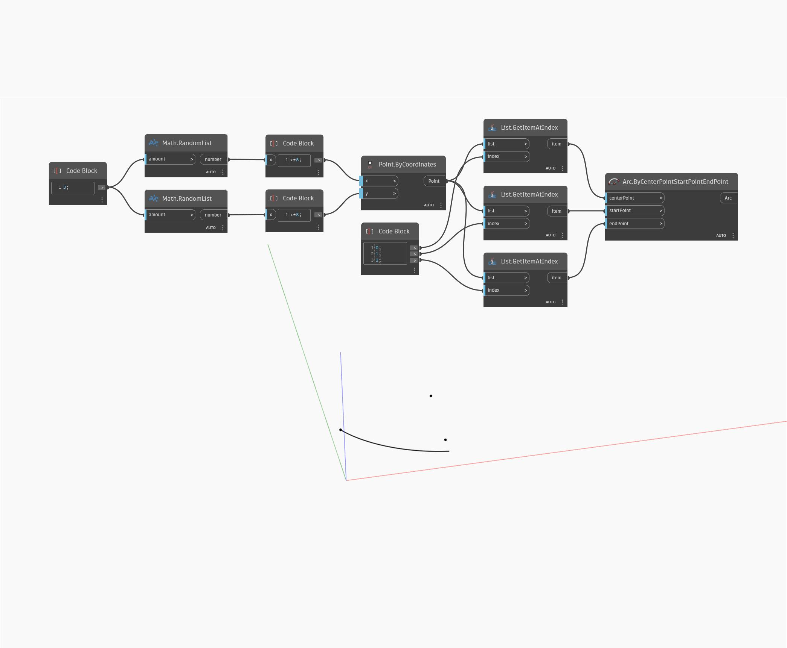

## In profondità
Arc.ByCenterPointStartPointEndPoint disegna un arco di adattamento attorno ad un centro specificato. L'arco inizierà sempre in corrispondenza del punto iniziale e terminerà in corrispondenza del punto più vicino possibile al punto finale specificato. In questo esempio, viene illustrata questa proprietà inserendo in modo casuale nel nodo tre punti casuali per il punto centrale, iniziale e finale.
___
## File di esempio

