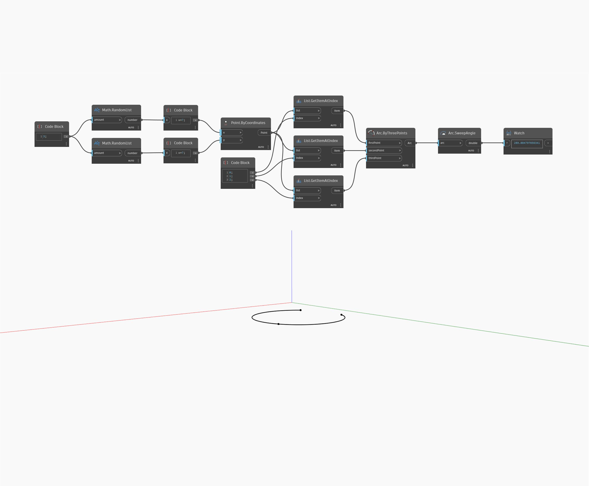

## In profondità
SweepAngle trova l'angolo iniziale dell'arco di ellisse. Questo valore viene misurato in gradi in senso antiorario sul piano dell'ellisse, a partire dall'angolo iniziale. L'angolo finale dell'ellisse sarebbe uguale all'angolo iniziale più l'angolo dell'estrusione su percorso. Nell'esempio, si crea prima un arco di ellisse utilizzando il piano XY e una serie di Number Slider. Si utilizza quindi SweepAngle per estrarre la lunghezza dell'arco di ellisse.
___
## File di esempio

