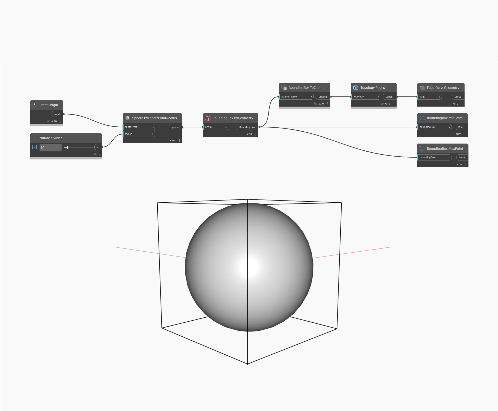

## In profondità
`BoundingBox.ByGeometry` crea un BoundingBox attorno alla geometria.

Nell'esempio seguente, viene creato un BoundingBox attorno ad una sfera. Per visualizzare il riquadro, viene convertito in un cuboide e le relative curve dei bordi vengono estratte.

___
## File di esempio

