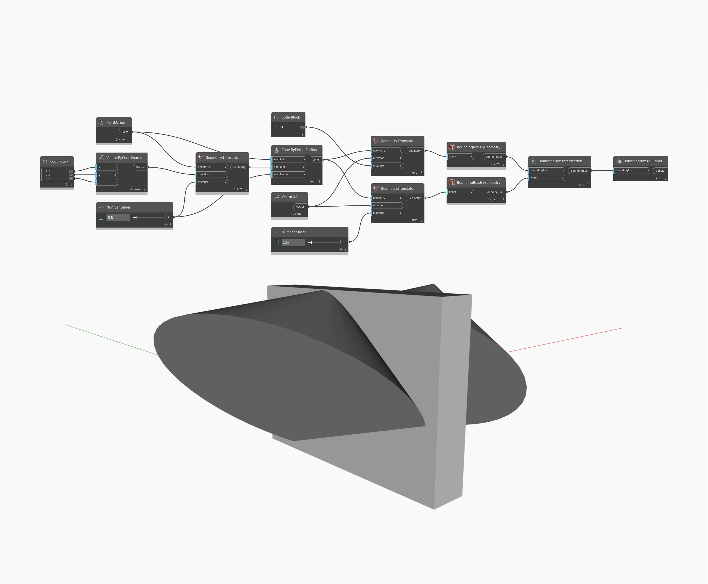

## In profondità
BoundingBox.Intersection risolve l'intersezione per due riquadri di delimitazione e restituisce il riquadro di delimitazione sovrapposto. In questo esempio, vengono utilizzati due coni per dimostrare l'utilizzo di questo nodo. Per visualizzare il riquadro, è necessario convertirla in un cuboide.
___
## File di esempio

