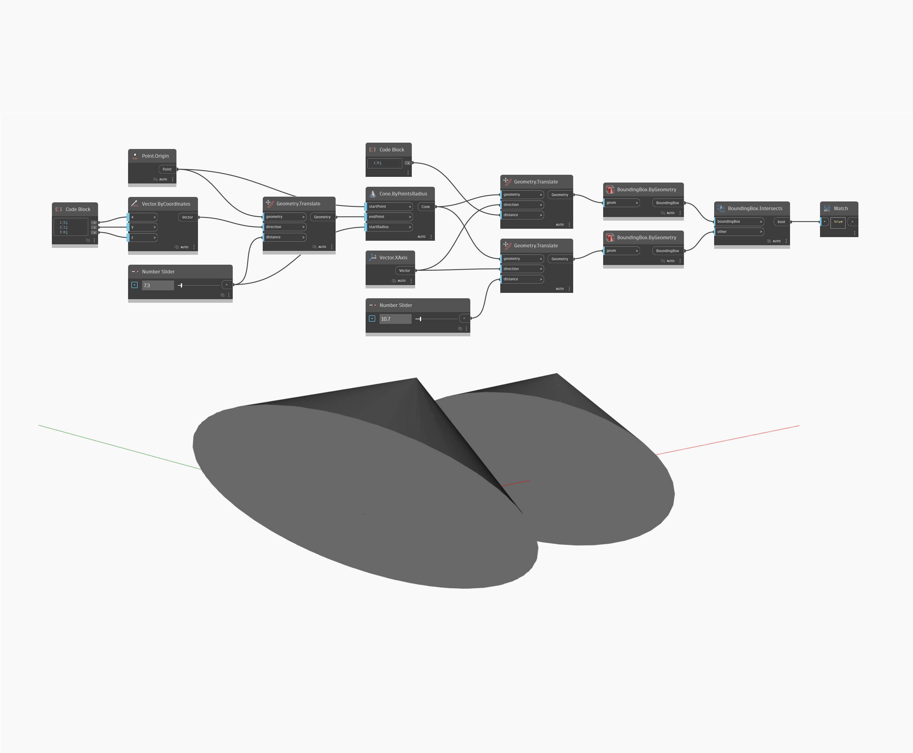

## In profondità
BoundingBox.Intersects verifica se due riquadri di delimitazione si sovrappongono. Se i riquadri si intersecano, il nodo restituirà True, altrimenti restituirà False. In questo esempio, viene verificata l'intersezione tra i riquadri di delimitazione di due coni di input.
___
## File di esempio

