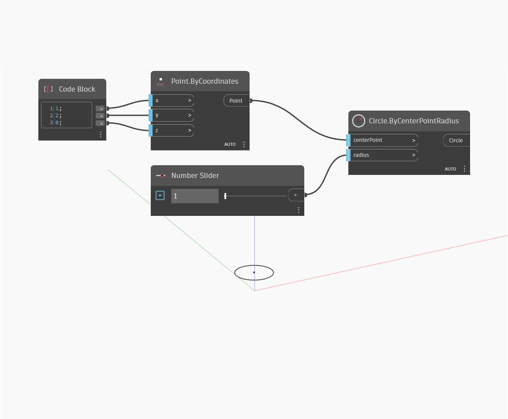

## In profondità
`Circle.ByCenterPointRadius` crea un cerchio con la normale del piano Z.

Nell'esempio seguente, viene utilizzato un blocco di codice per creare un punto nello spazio tridimensionale e individuare il cerchio attorno al punto. Il raggio viene controllato dinamicamente con un dispositivo di scorrimento numerico.

___
## File di esempio

