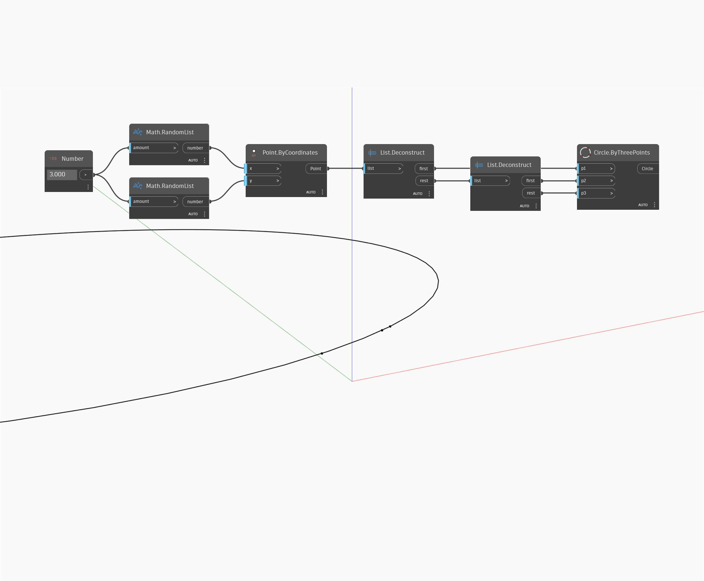

## In profondità
`Circle.ByThreePoints` riceve 3 input points e crea un cerchio che passa per ogni punto.

Nell'esempio seguente, vengono utilizzati 3 punti generati in modo casuale sul piano Z per creare un cerchio.

___
## File di esempio

