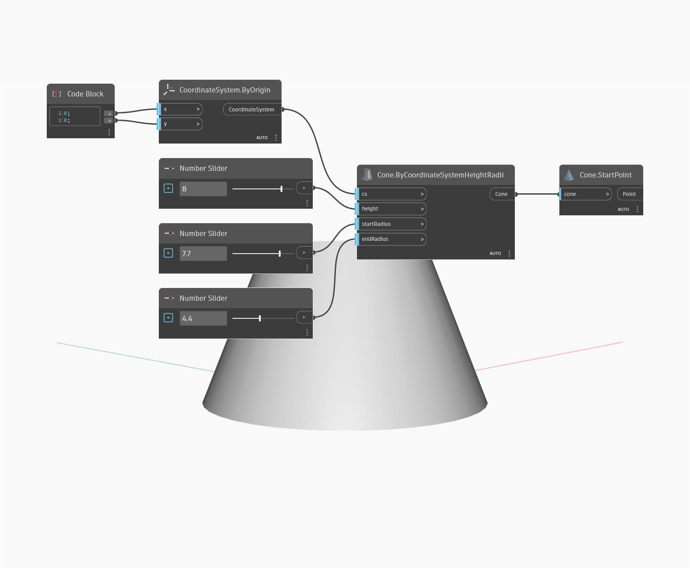

## In profondità
`Cone.StartPoint` trova il centro della base di un cono.

Nell'esempio seguente, viene creato un cono specificando un sistema di coordinate e due raggi. Viene quindi utilizzato `Cone.StartPoint` per trovare il centro del cerchio inferiore del cono.

___
## File di esempio

