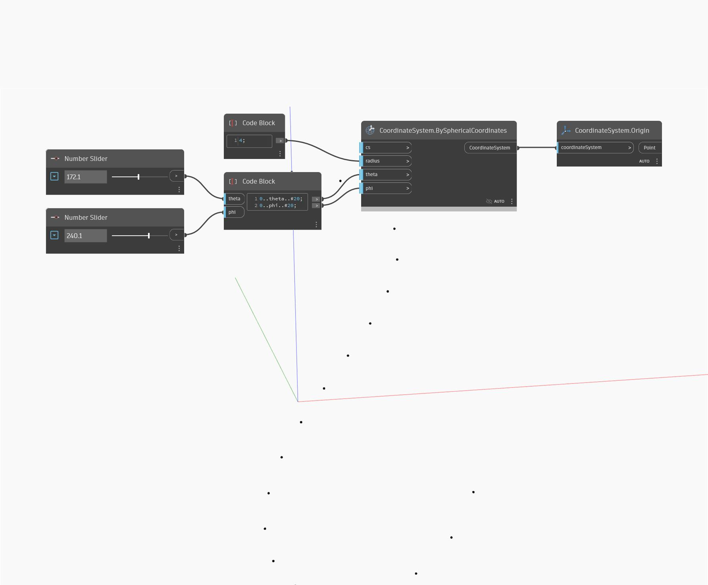

## In profondità
Origin restituirà un punto in corrispondenza dell'origine di WorldCoordinateSystem. Nell'esempio seguente, viene creato un cerchio mediante un punto centrale e un raggio utilizzando un punto in corrispondenza dell'origine del sistema WCS.
___
## File di esempio

