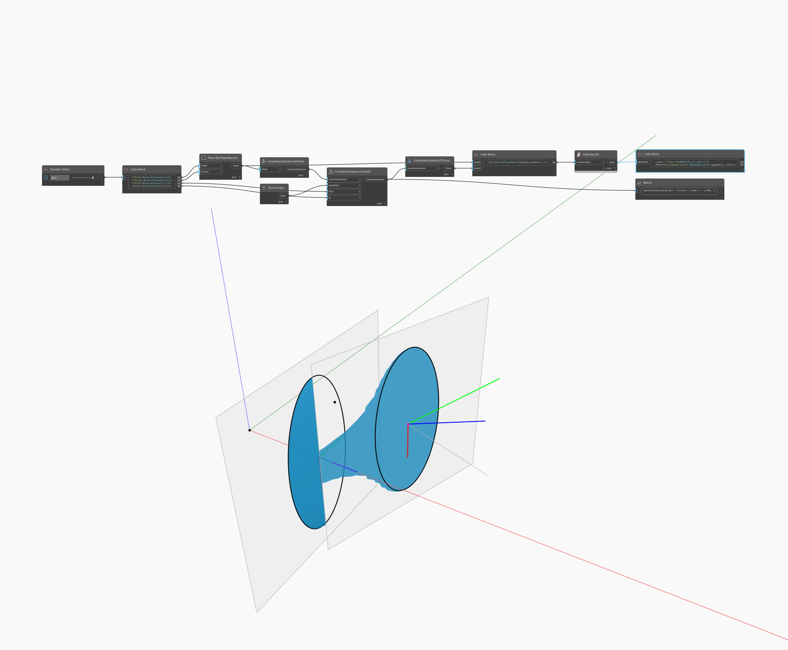

## In profondità
Scale1D adatta in scala una geometria in una direzione da un punto di base e due punti di riferimento. Nel file di esempio, un cono viene adattato in scala dal punto finale al baricentro rispetto al punto iniziale del cono. I bordi del cono originale vengono disegnati come riferimento visivo.
___
## File di esempio

