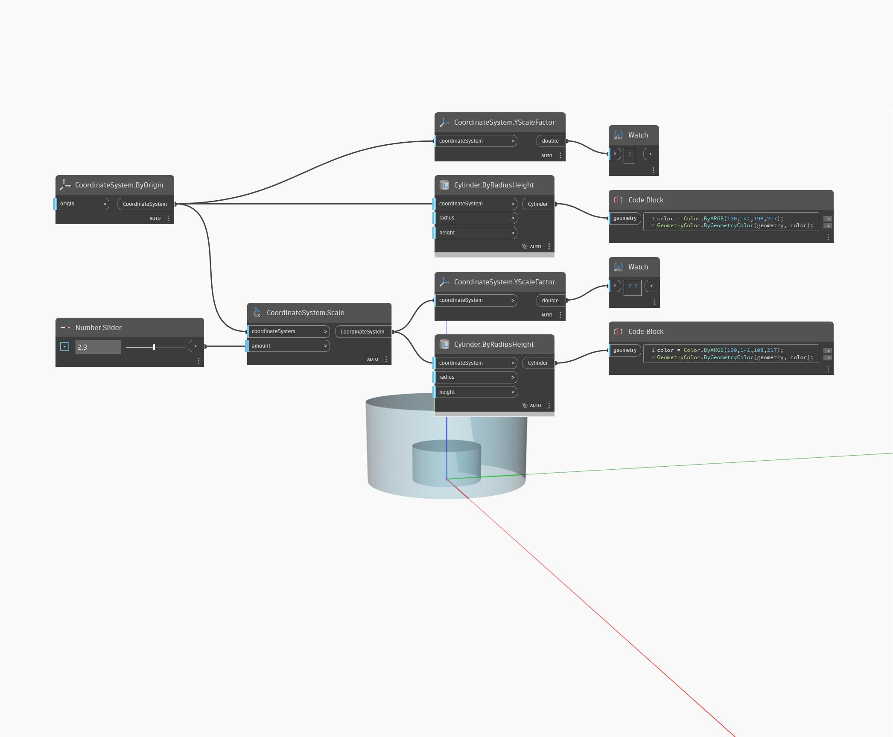

## In profondità
YScaleFactor restituirà un double che rappresenta il fattore di scala lungo l'asse Y. Nell'esempio seguente, un cilindro viene adattato in scala di 2.3, restituendo un fattore di scala Y di 2.3.
___
## File di esempio

