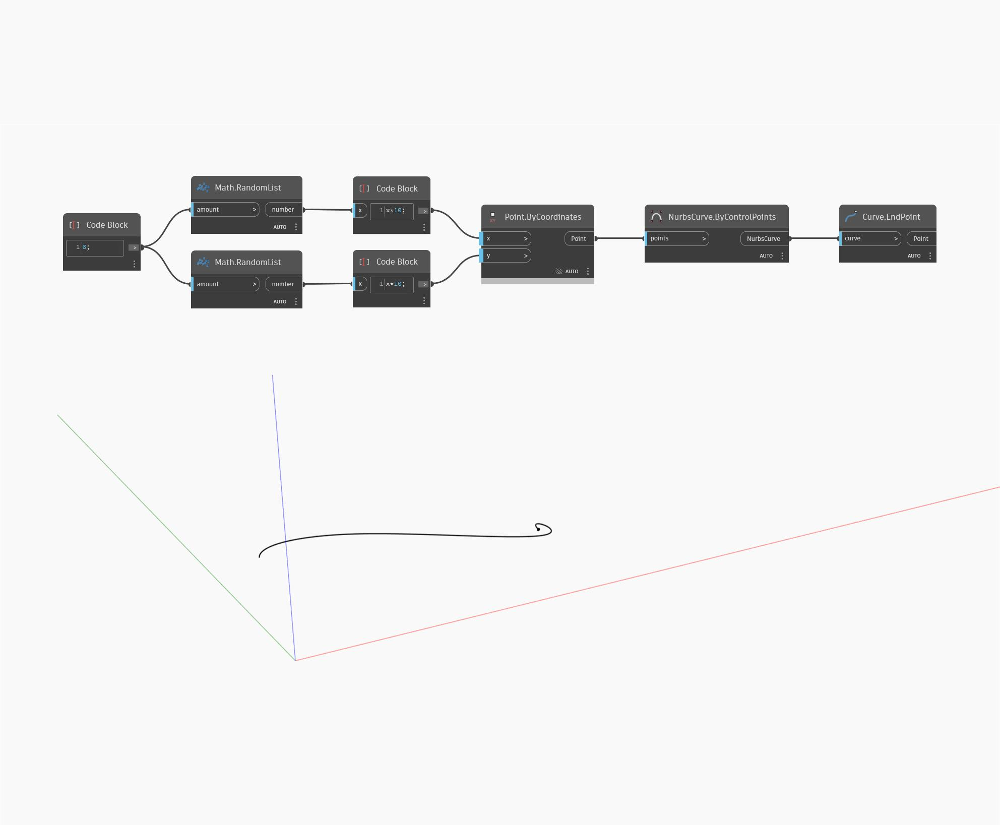

## In profondità
EndPoint restituirà il punto finale di una curva di input. Nell'esempio seguente, viene prima creata una curva NURBS utilizzando un nodo ByControlPoints, con un insieme di punti generati casualmente come input. È possibile trovare il punto finale di questa curva utilizzando un nodo EndPoint.
___
## File di esempio

