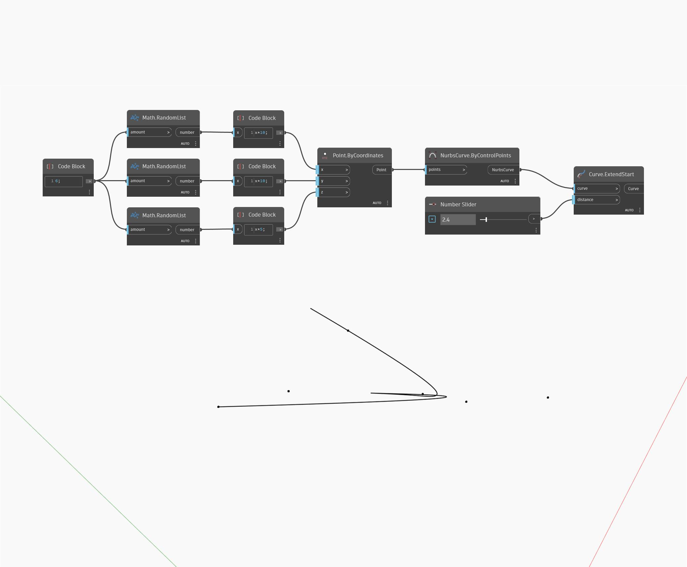

## In profondità
ExtendStart estenderà una curva di input di una determinata distanza di input, a partire dal punto iniziale della curva. Nell'esempio seguente, viene prima creata una curva NURBS utilizzando un nodo ByControlPoints, con un insieme di punti generati casualmente come input. Un Number Slider consente di controllare la distanza dell'estensione.
___
## File di esempio

