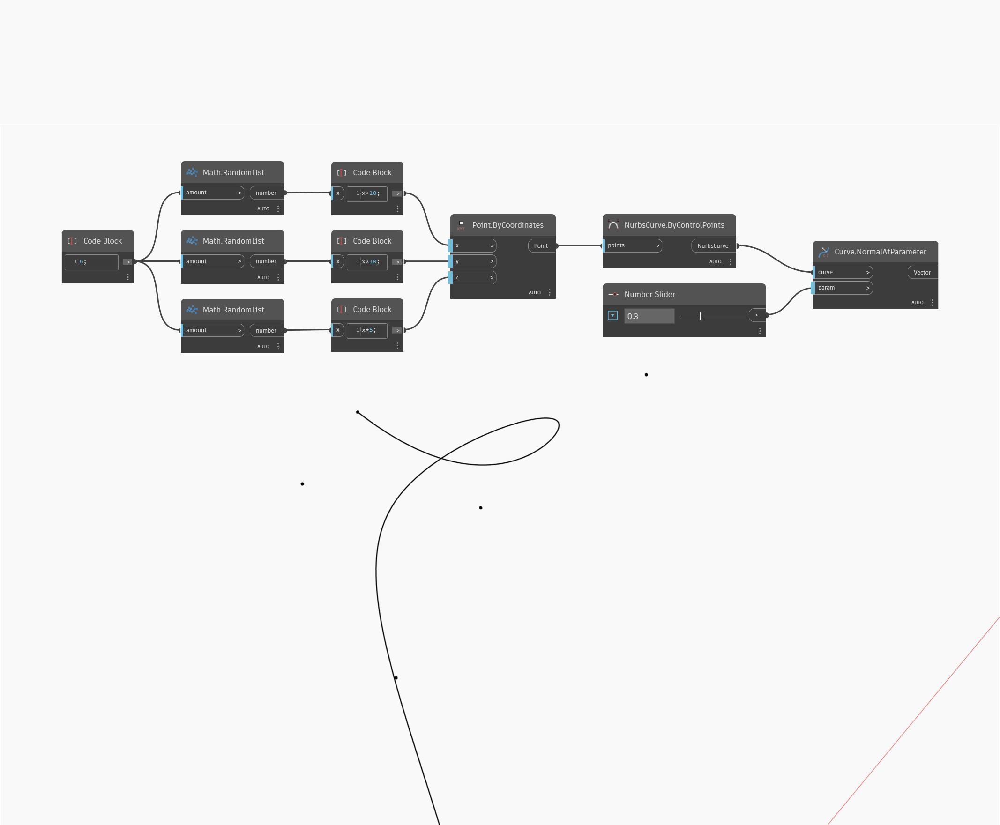

## In profondità
NormalAtParameter utilizza i parametri di input U e V e restituisce il vettore normale della superficie in corrispondenza della posizione UV di input sulla superficie. Nell'esempio seguente, viene prima creata una superficie utilizzando Sweep2Rails. Vengono quindi utilizzati due Number Slider per determinare i parametri U e V per determinare la normale con un nodo NormalAtParameter.
___
## File di esempio

