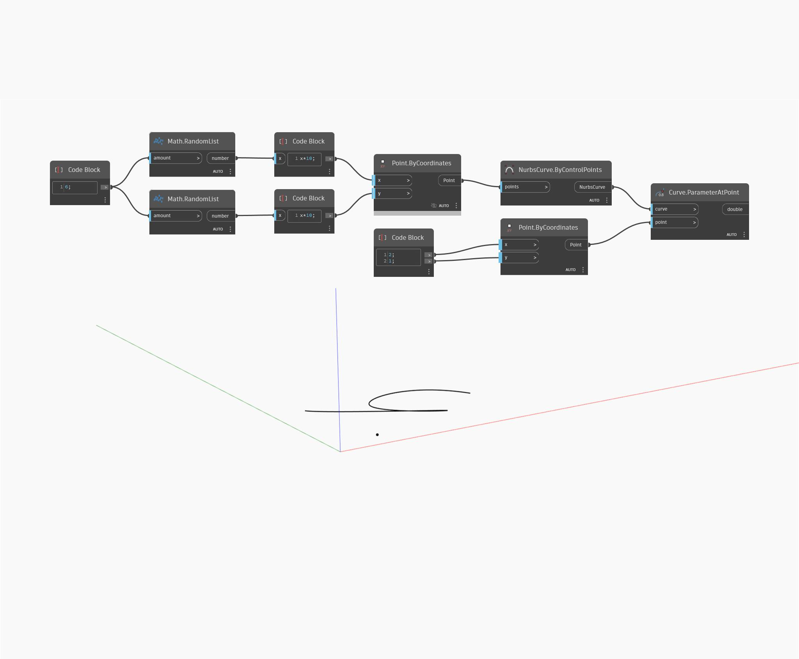

## In profondità
ParameterAtPoint restituirà il valore del parametro di un punto specificato lungo una curva. Se il punto di input non si trova sulla curva, ParameterAtPoint restituirà il parametro del punto sulla curva che si chiude al punto di input. Nell'esempio seguente, viene prima creata una curva NURBS utilizzando un nodo ByControlPoints, con un insieme di punti generati casualmente come input. Viene creato un punto singolo aggiuntivo con un Code Block per specificare le coordinate x e y. Il nodo ParameterAtPoint restituisce il parametro lungo la curva in corrispondenza del punto più vicino al punto di input.
___
## File di esempio

