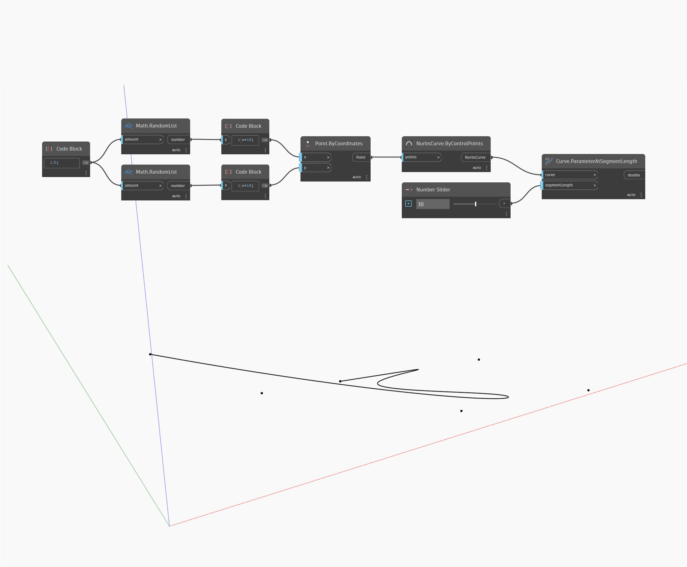

## In profondità
ParameterAtSegmentLength restituirà il parametro di un punto che è una lunghezza specificata lungo la curva dal punto iniziale. Nell'esempio seguente, viene creata prima una curva NURBS utilizzando un nodo ByControlPoints, con un insieme di punti generati casualmente come input. Viene utilizzato un Number Slider per controllare la lunghezza del segmento in base a cui trovare un parametro. Se la lunghezza del segmento di input è più lunga della curva, questo nodo restituirà il valore del parametro del punto finale della curva.
___
## File di esempio

