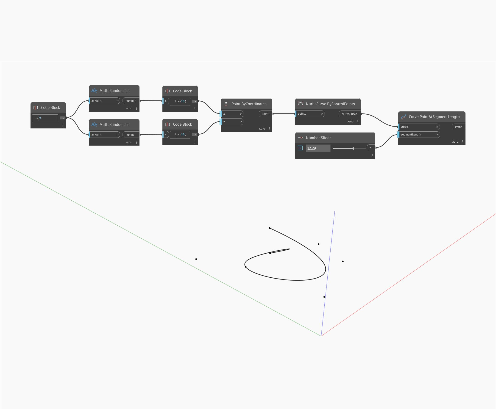

## In profondità
PointAtSegmentLength restituirà il punto su una curva ad una determinata lunghezza lungo la curva, misurata dal punto iniziale della curva. Se la lunghezza di input è maggiore della lunghezza della curva, il nodo restituirà il punto finale della curva. Nell'esempio seguente, vengono utilizzati due insieme di numeri casuali per generare un elenco di punti. Questi punti vengono utilizzati per creare un nodo NurbsCurve.ByControlPoints. Viene utilizzato un Number Slider come lunghezza di input in un nodo PointAtSegmentLength.
___
## File di esempio

