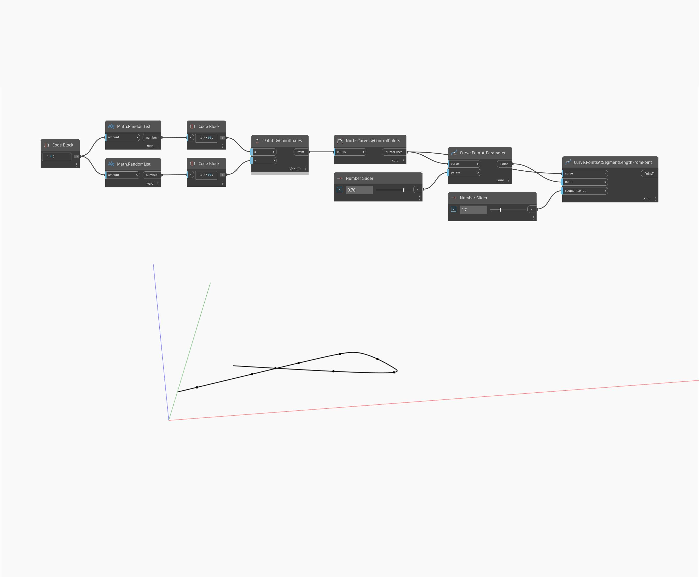

## In profondità
PointsAtSegmentLengthFromPoint restituirà un elenco di punti lungo una curva, misurati in sequenza in base alla lunghezza del segmento di input che inizia da un punto specificato lungo la curva. Nell'esempio seguente, viene prima creata una curva NURBS utilizzando un nodo ByControlPoints, con un insieme di punti generati in modo casuale come input. Viene utilizzato un nodo PointAtParameter con un Number Slider impostato sull'intervallo compreso tra 0 e 1 per determinare il punto iniziale lungo la curva per un nodo PointsAtSegmentLengthFromPoint. Infine, viene utilizzato un secondo Number Slider per regolare la lunghezza del segmento di curva da utilizzare.
___
## File di esempio

