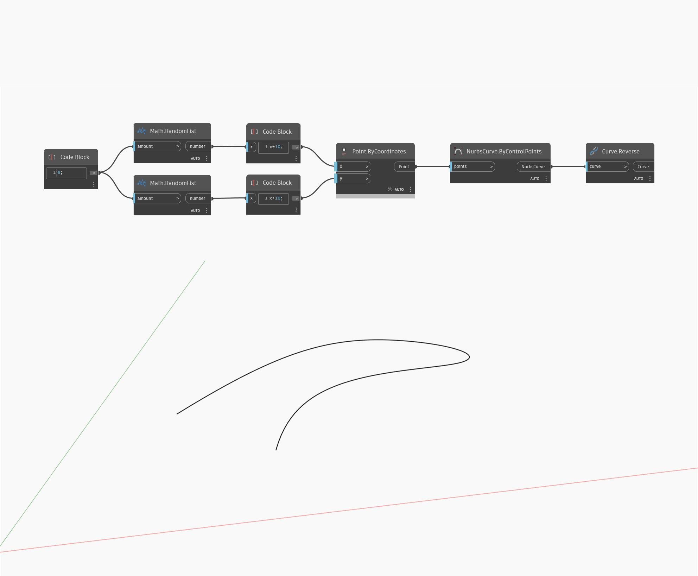

## In profondità
Reverse restituirà un nuovo vettore che punta nella direzione opposta rispetto all'input. Nell'esempio seguente, un vettore di (1,0,1) restituirà un vettore di (-1,0,-1). La regolazione del dispositivo di scorrimento Vector Direction modificherà i valori delle coordinate del vettore e restituirà un vettore inverso diverso. I vettori sono rappresentati come linee.
___
## File di esempio

