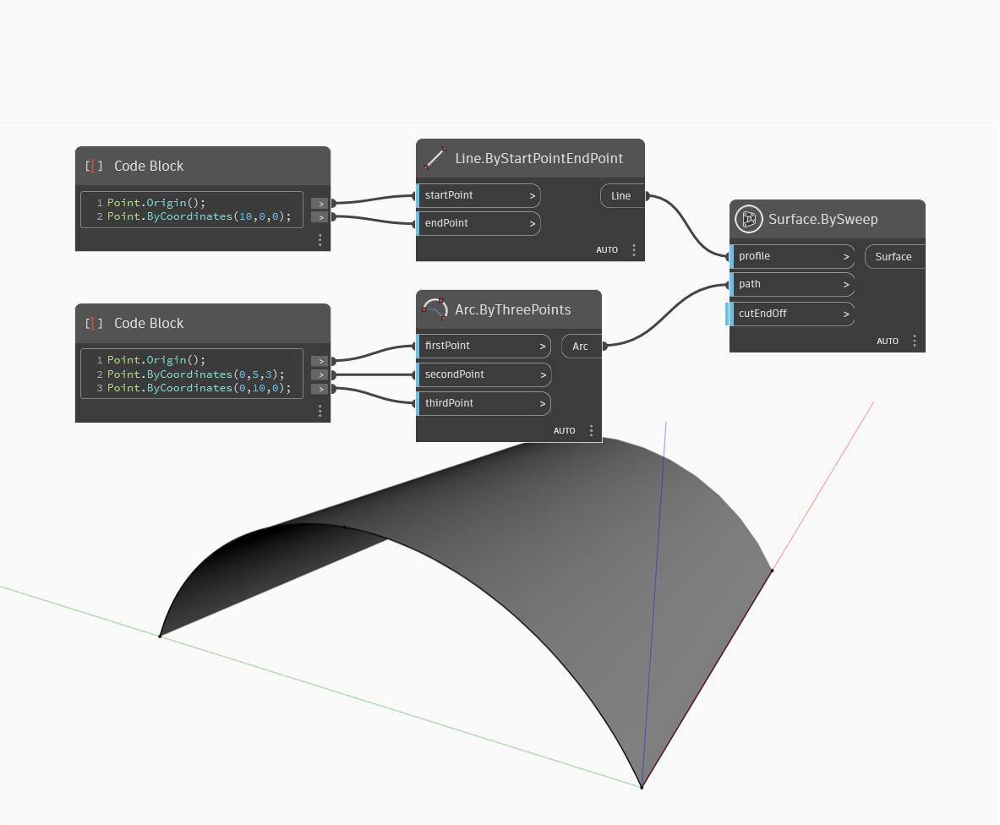

## In profondità
SweepAsSurface creerà una superficie con estrusione su percorso di una curva di input lungo una traiettoria specificata. Nell'esempio seguente, viene creata una curva di cui eseguire l'estrusione su percorso utilizzando un Code Block per creare tre punti di un nodo Arc.ByThreePoints. Viene creata una curva della traiettoria da una linea semplice lungo l'asse x. SweepAsSurface sposta la curva di profilo lungo la curva della traiettoria creando una superficie.
___
## File di esempio

