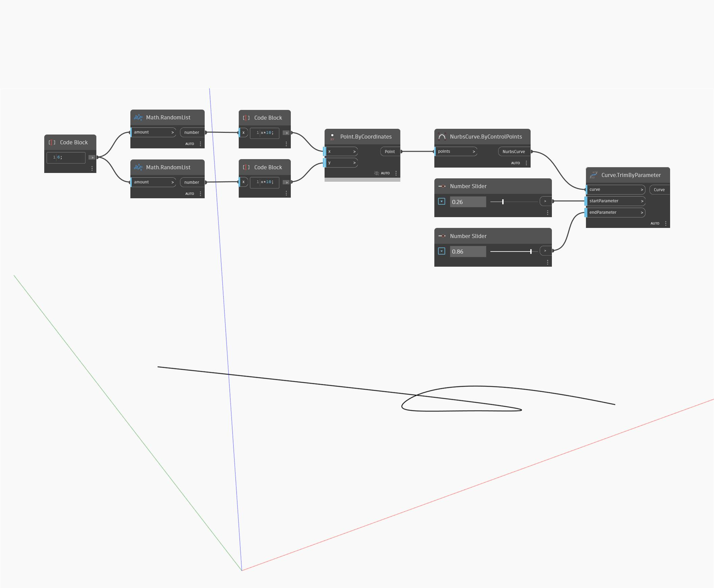

## In profondità
Curve.TrimByParameter rimuoverà l'inizio e la fine di una curva di input tagliando la curva in corrispondenza dei parametri specificati e restituirà la sezione centrale risultante della curva. Nell'esempio seguente, viene prima creata una curva NURBS utilizzando un nodo ByControlPoints, con un insieme di punti generati casualmente come input. Vengono utilizzati due Number Slider impostati sull'intervallo compreso tra 0 e 1 per controllare gli input startParameter ed endParameter per un nodo Curve.TrimByParameter.
___
## File di esempio

