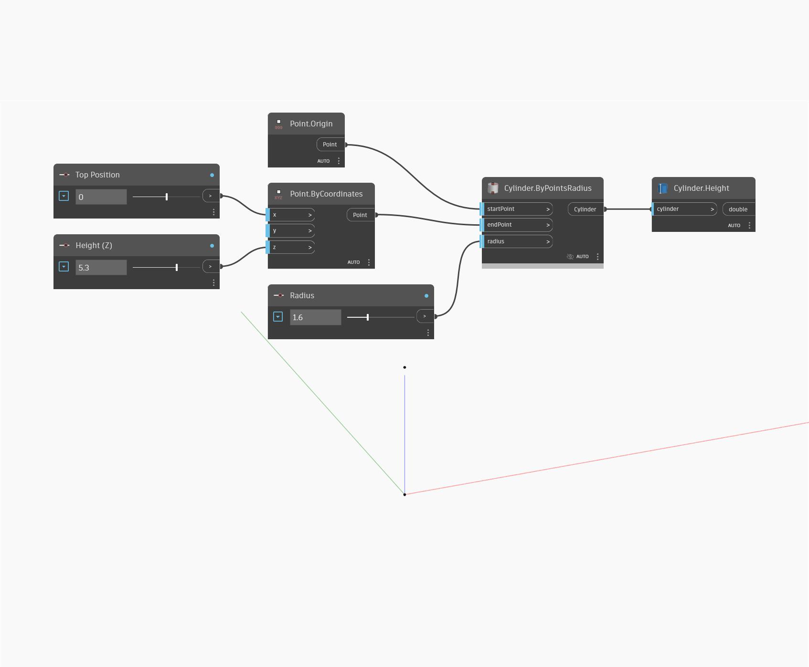

## In profondità
`Cylinder.Height` restituisce l'altezza del cilindro di input. Il valore dell'altezza è relativo alla scala della vista.

Nell'esempio seguente, viene generato un cilindro in base al punto iniziale, al punto finale e al raggio, quindi viene utilizzato un nodo `Cylinder.Height` per trovare l'altezza.

___
## File di esempio

