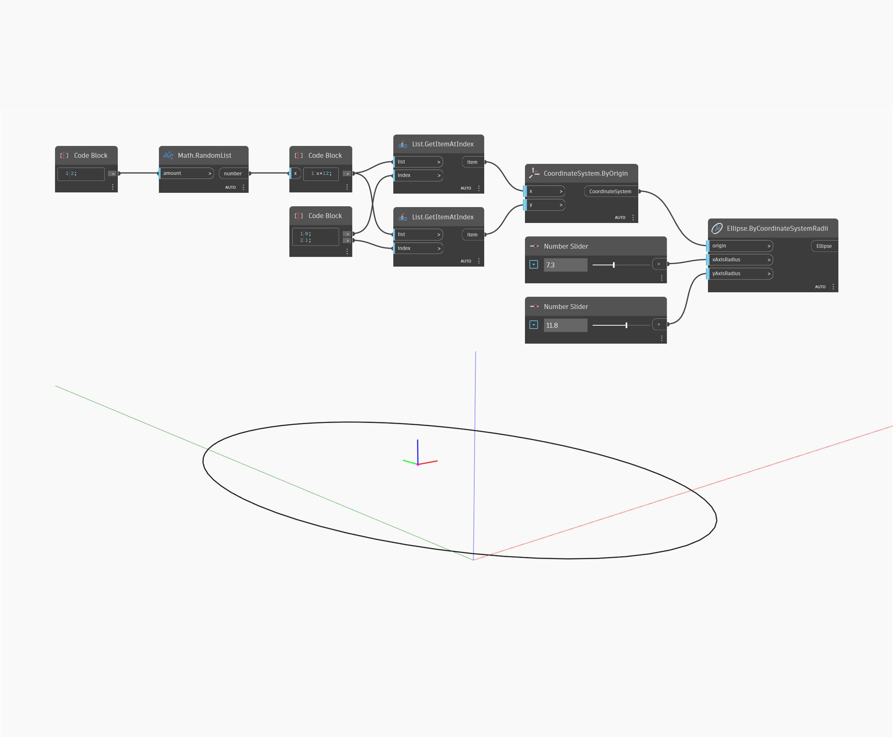

## In profondità
Ellipse.ByCoordinateSystemRadii utilizza un sistema di coordinate come input, quindi crea un'ellisse utilizzando i raggi inseriti. I valori di input xAxisRadius e yAxisRadius corrispondono alle direzioni X e Y del sistema di coordinate di input (non alle direzioni X e Y globali). Nel file di esempio, vengono generati due valori casuali per creare un sistema di coordinate, quindi viene utilizzato quel sistema di coordinate con due Number Slider per i raggi X e Y.
___
## File di esempio

