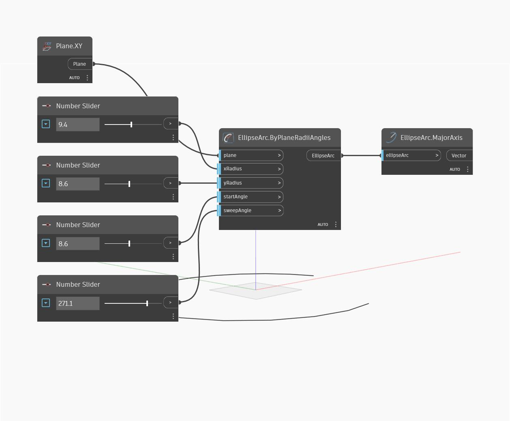

## In profondità
MajorAxis restituirà il più lungo dei due assi dell'ellisse. L'asse viene generato come vettore, con un'intensità uguale al maggiore dei due raggi. Notare che gli assi maggiore e minore vengono determinati dalla lunghezza e non dalla direzione. Ossia, l'asse maggiore potrebbe corrispondere a xAxisRadius di un'ellisse, ma a yAxisRadius di un'ellisse diversa. Nell'esempio, viene primo creato un arco di ellisse utilizzando il piano XY e una serie di Number Slider. Si utilizza quindi MajorAxis per estrarre l'asse maggiore dell'ellisse.
___
## File di esempio

