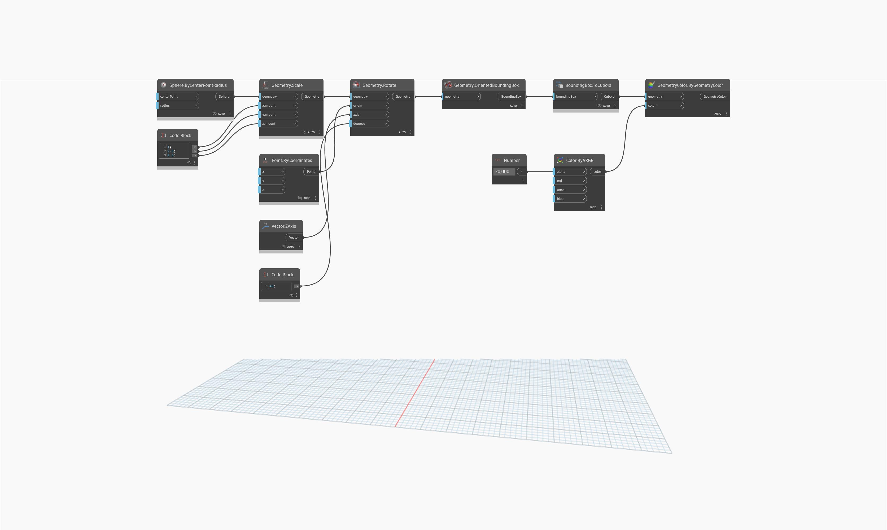

## In profondità
`Geometry.OrientedBoundingBox` restituisce un riquadro orientato, dal volume minimo che è definito dalla geometria che contiene. Non viene visualizzato un BoundingBox, ma può essere restituito come PolySurface utilizzando il nodo `BoundingBox.ToPolySurface`.

Nell'esempio seguente, viene creato un BoundingBox per un solido unito e rappresentato come PolySurface.
___
## File di esempio

