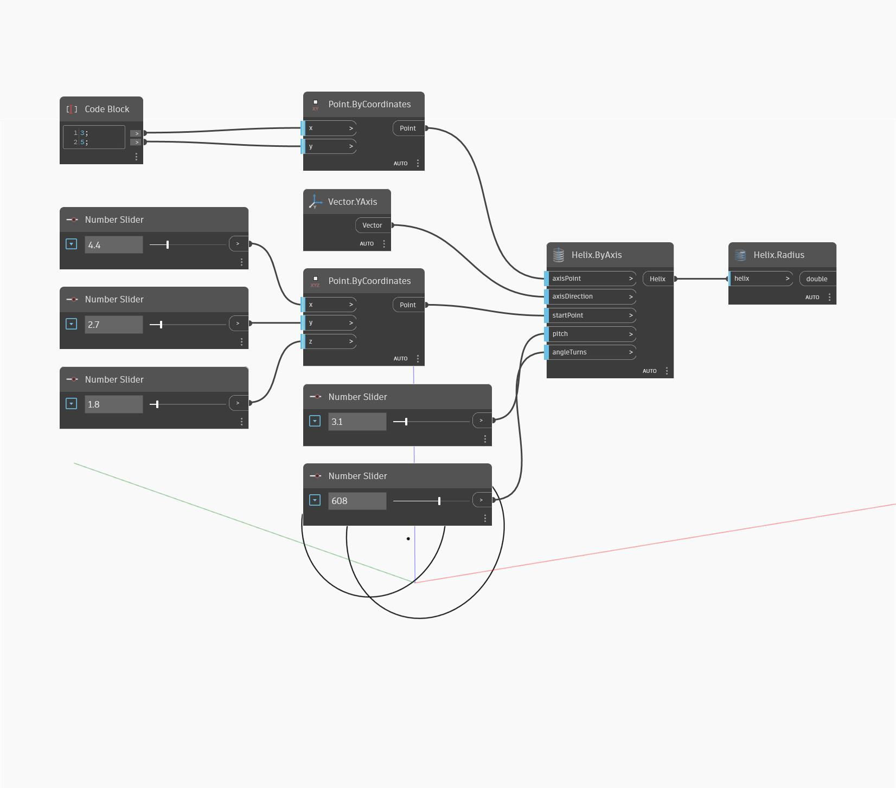

## In Depth
`Helix.Radius` returns the distance from the central axis to the point on the helix on a plane perpendicular to the axis. 

In the example below, we create a helix using `Helix.ByAxis`, then use `Helix.Radius` to find the radius of the helix.

___
## Example File

