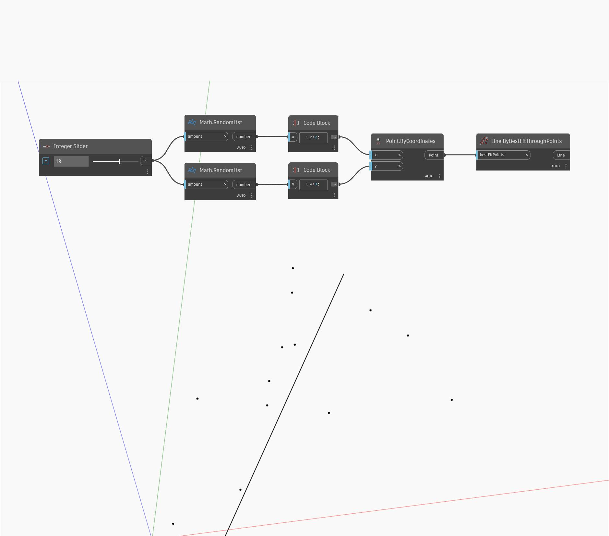

## In profondità
`Line.BestFitThroughPoints` crea una linea avvicinandosi ad un grafico a dispersione di punti. L'input è un elenco di punti.

Nell'esempio seguente, viene utilizzato un dispositivo di scorrimento numerico per controllare il numero di punti casuali generati e quindi trovare la linea di adattamento che passa per l'insieme di punti.

___
## File di esempio

