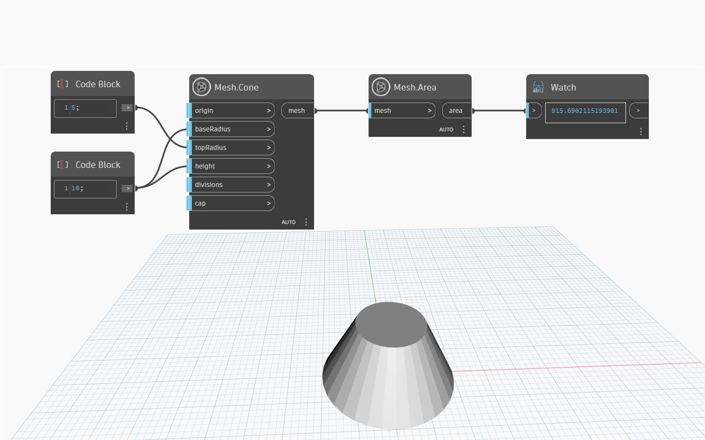

## In profondità
`Mesh.Area` restituisce l'area della mesh di input. Nell'esempio seguente, viene creato un cono utilizzando il nodo `Mesh.Cone`. Quindi il nodo `Mesh.Area` viene utilizzato per calcolare l'area della mesh del cono.

## File di esempio

