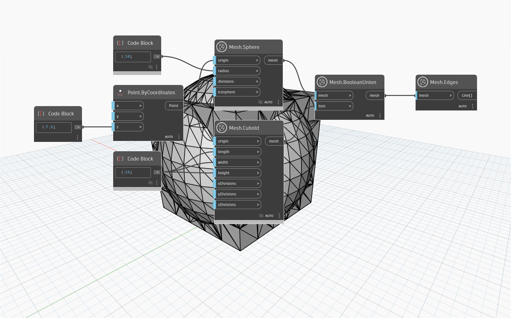

## In profondità
Il nodo `Mesh.BooleanUnion` restituisce l'unione delle due mesh di input dopo averle unite in un'unica mesh e aver rimosso le parti sovrapposte delle mesh.
Nell'esempio seguente, viene utilizzato `Mesh.BooleanUnion` per unire due mesh, `Mesh.Sphere` e `Mesh.Cuboid`.

`Mesh.Edges` viene utilizzato per visualizzare la struttura della mesh.

## File di esempio

