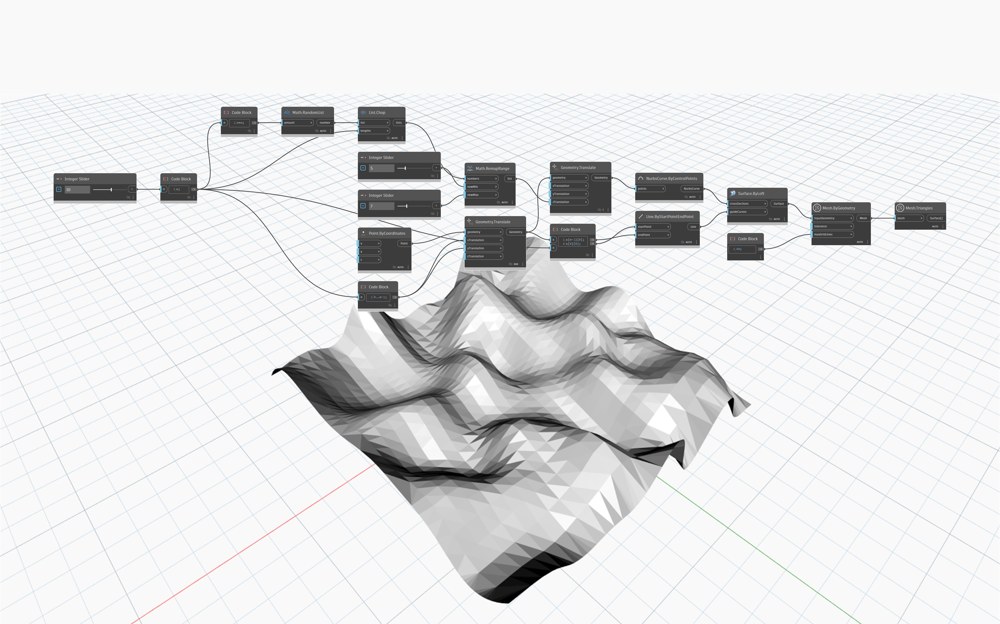

## In profondità
`Mesh.ByGeometry` utilizza gli oggetti geometrici di Dynamo (superfici o solidi) come input e li converte in una mesh. I punti e le curve non hanno rappresentazioni della mesh, pertanto non sono input validi. La risoluzione della mesh prodotta nella conversione viene controllata dai due input:`tolerance` e `maxGridLines`. `tolerance` consente di impostare la deviazione accettabile della mesh dalla geometria originale ed è soggetto alle dimensioni della mesh. Se il valore di `tolerance` è impostato su -1, Dynamo sceglie una tolleranza ragionevole. L'input `maxGridLines` imposta il numero massimo di linee di griglia nella direzione U o V. Un numero maggiore di linee di griglia contribuisce ad aumentare la levigatezza della tassellazione.

## File di esempio

