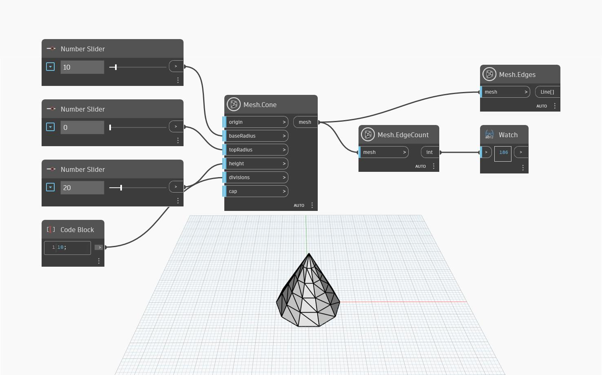

## In profondità
Questo nodo conteggia il numero di bordi in una determinata mesh. Se la mesh è composta da triangoli, come nel caso di tutte le mesh in `MeshToolkit`, il nodo `Mesh.EdgeCount` restituisce solo bordi univoci. Di conseguenza, ci si dovrebbe aspettare che il numero di bordi non sia il triplo del numero di triangoli nella mesh. Questo supposizione può essere utilizzata per verificare che la mesh non contenga eventuali facce non saldate (ciò può verificarsi nelle mesh importate).

Nell'esempio seguente, `Mesh.Cone` e `Number.Slider` vengono utilizzati per creare un cono, che viene quindi utilizzato come input per contare i bordi. Sia `Mesh.Edges` che `Mesh.Triangles` possono essere utilizzati per visualizzare in anteprima la struttura e la griglia di una mesh, mentre `Mesh.Edges` ha prestazioni migliori per mesh complesse e pesanti.

## File di esempio

