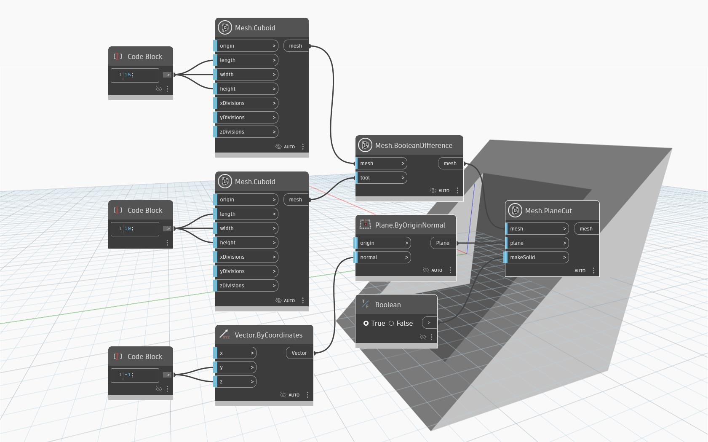

## In profondità
`Mesh.PlaneCut` restituisce una mesh che è stata tagliata da un determinato piano. Il risultato del taglio è la parte della mesh che si trova sul lato del piano nella direzione della normale dell'input `plane`. Il parametro `makeSolid` controlla se la mesh viene trattata come `Solid`, nel qual caso il taglio viene riempito con il minor numero possibile di triangoli per coprire ogni foro.

Nell'esempio seguente, una mesh cava ottenuta da un'operazione `Mesh.BooleanDifference` viene tagliata da un piano ad angolo.

## File di esempio

