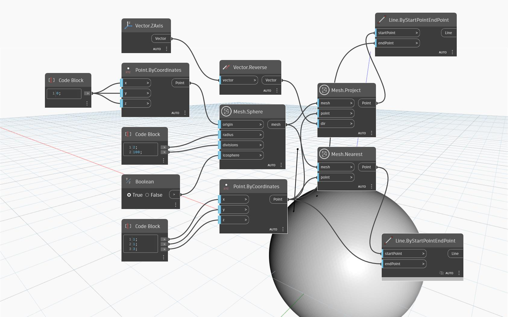

## In profondità
`Mesh.Project` restituisce un punto sulla mesh di input che è una proiezione del punto di input sulla mesh nella direzione del vettore specificato. Affinché il nodo funzioni correttamente, una linea disegnata dal punto di input nella direzione del vettore di input deve intersecarsi con la mesh specificata.

Il grafico di esempio mostra un semplice caso di utilizzo del funzionamento del nodo. Il punto di input si trova al di sopra di una mesh sferica, ma non direttamente in cima. Il punto viene proiettato nella direzione del vettore dell'asse 'Z' negativo. Il punto risultante viene proiettato sulla sfera e visualizzato al di sotto del punto di input. Ciò è in contrasto con l'output del nodo `Mesh.Nearest` (utilizzando lo stesso punto e la stessa mesh degli input) dove il punto risultante si trova sulla mesh lungo il 'vettore normale' che passa attraverso il punto di input (il punto più vicino). `Line.ByStartAndEndPoint` viene utilizzato per mostrare la 'traiettoria' del punto proiettato sulla mesh.

## File di esempio

