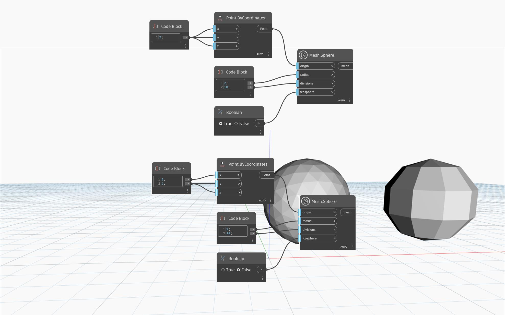

## In profondità
`Mesh.Sphere` crea una mesh sfera, centrata nel punto di input `origin`, con un determinato `radius` e un numero di `divisions`. L'input booleano `icosphere` viene utilizzato per passare tra i tipi di mesh sferica `icosphere` e `UV-Sphere`. Una mesh icosfera copre la sfera con triangoli più regolari rispetto a una mesh UV e tende a fornire risultati migliori nelle operazioni di modellazione a valle. I poli di una mesh UV sono allineati con l'asse della sfera e i layer triangolari vengono generati longitudinalmente attorno all'asse.

Nel caso dell'icosfera, il numero di triangoli attorno all'asse della sfera potrebbe essere tanto basso quanto il numero specificato di divisioni e al massimo il doppio di quel numero. Le divisioni di `UV-sphere` determinano il numero di layer triangolari generati longitudinalmente attorno alla sfera. Quando l'input `divisions` è impostato su zero, il nodo restituisce una sfera UV con un numero di default di 32 divisioni per entrambi i tipi di mesh.

Nell'esempio seguente, il nodo `Mesh.Sphere` viene utilizzato per creare due sfere con input radius and divisions identici, ma utilizzando metodi diversi. Quando l'input `icosphere` è impostato su `True`, `Mesh.Sphere` restituisce `icosphere`. In alternativa, quando l'input `icosphere` è impostato su `False`, il nodo `Mesh.Sphere` restituisce `UV-sphere`.

## File di esempio

