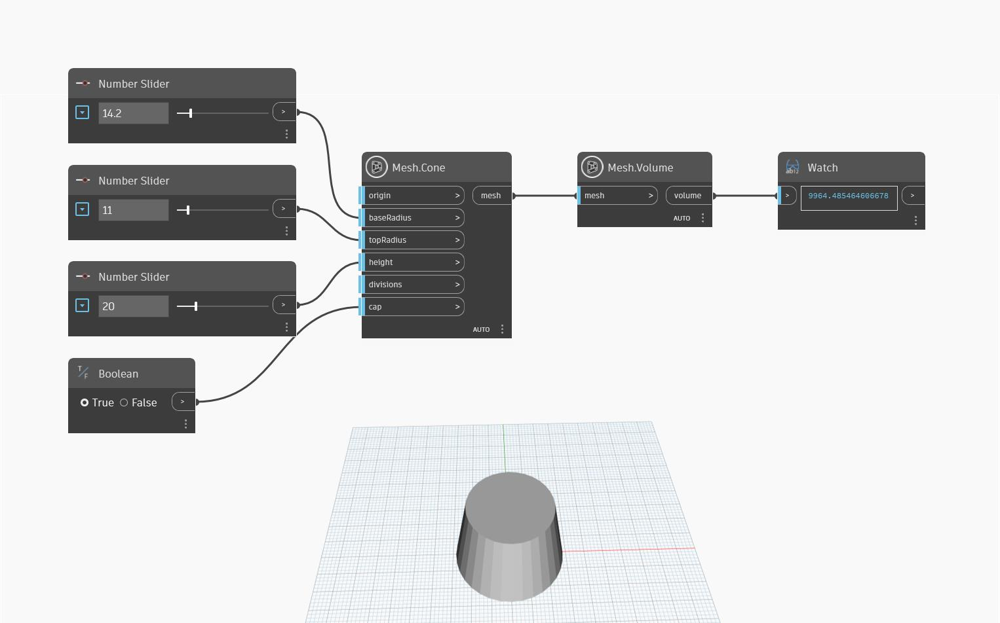

## In profondità
`Mesh.Volume` restituisce il volume di una mesh solida non intersecante. Nell'esempio seguente, `Mesh.Cone` e `Number.Slider`vengono utilizzati per creare un cono, che viene quindi utilizzato come input per contare i triangoli. `Mesh.Volume` può anche essere utile per determinare se la superficie di una mesh è chiusa. Infatti, se la mesh ha una superficie aperta, il nodo riporterà un valore `null`.

## File di esempio

