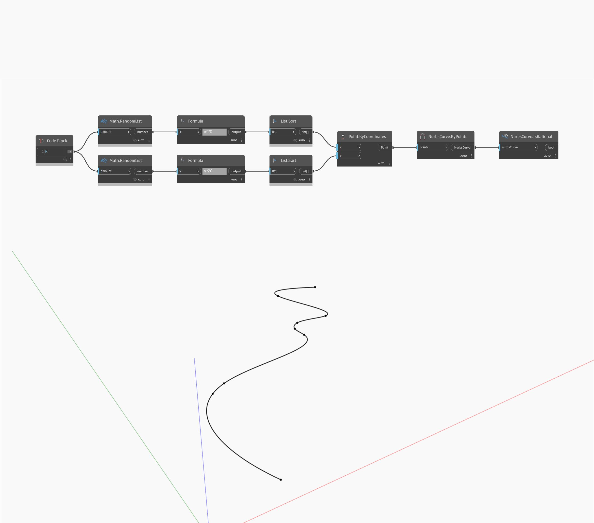

## In profondità
IsRational restituirà un valore booleano a seconda del fatto che una NurbsSurface sia o meno razionale. Nell'esempio seguente, una NurbsSurface creata avvicinandosi ad una superficie restituisce un valore false.
___
## File di esempio

