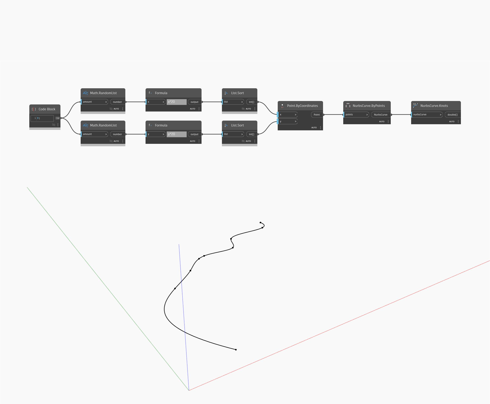

## In profondità
Knots restituirà i nodi di una curva NURBS come elenco di numeri. Nell'esempio, si genererà prima un numero di punti casuali, quindi si utilizzerà NurbsCurve.ByPoints per creare una curva interpolata attraverso i punti. È possibile utilizzare Knots per ottenere quindi un elenco dei nodi per questa curva.
___
## File di esempio

