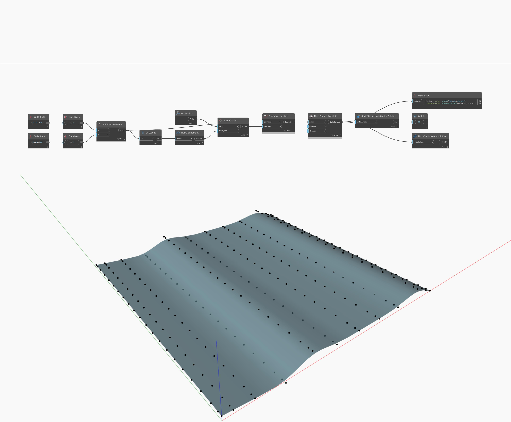

## In profondità
NumControlPointsU conteggerà i punti di controllo nella direzione U di una NurbsSurface e restituirà un numero intero. Nell'esempio seguente, NurbsSurface restituisce un numero intero di 22 per i relativi punti di controllo U. I punti di controllo vengono restituiti come punti utilizzando NurbsSurface.ControlPoints.
___
## File di esempio

