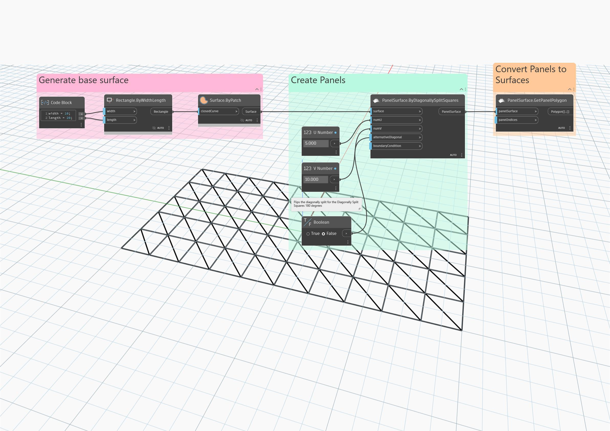

## In profondità
Dispone in pannelli la superficie di input in una griglia quadrata, con ogni quadrato diviso in due triangoli in base ad una diagonale. Per default, la diagonale va dall&apos;angolo inferiore sinistro all&apos;angolo superiore destro.
___
## File di esempio

