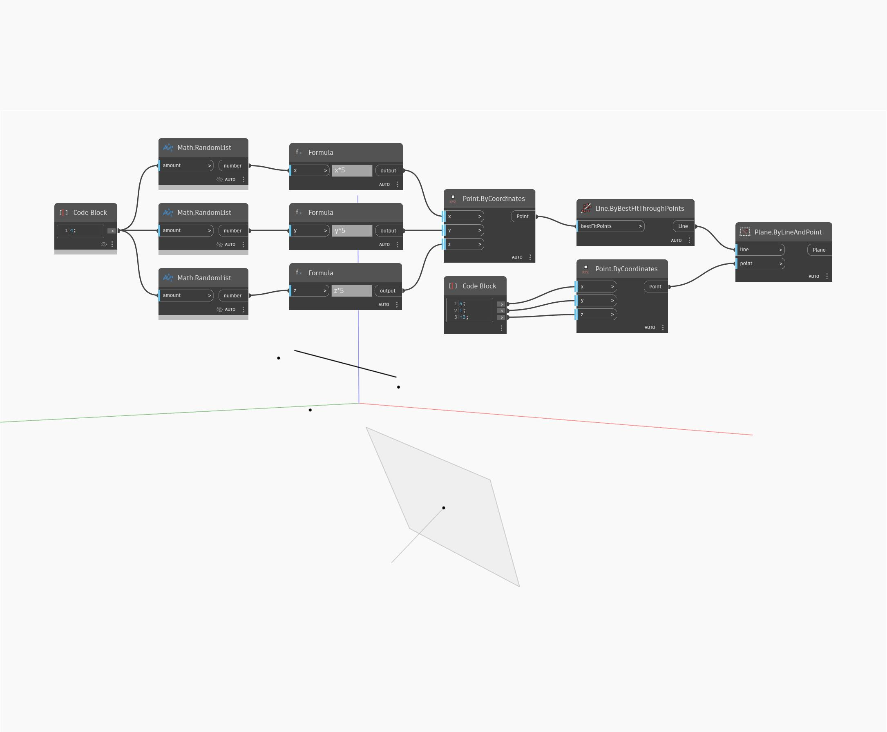

## In profondità
Plane.ByLineAndPoint crea un piano utilizzando il punto di input come origine e passando attraverso la linea di input. Il punto non deve trovarsi sull'asse della linea. Nell'esempio, si crea una linea utilizzando prima un insieme di punti casuali e creando quindi una linea con ByBestFitThroughPoints. Viene creato un punto di origine con un Code Block che fornisce le coordinate x,y e z per un componente Point.ByCoordinates. Si utilizzano quindi la linea e il punto come input per creare un nodo Plane.ByLineAndPoint.
___
## File di esempio

